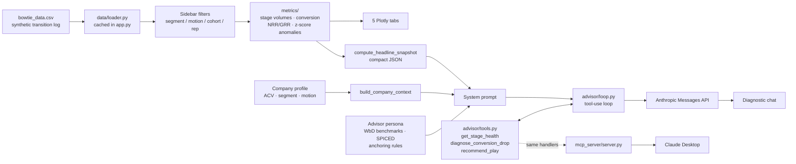

# GTM Health Diagnostic

A diagnostic dashboard for B2B SaaS revenue teams, built on the Winning by Design Bowtie framework, with an AI advisor that reads the filtered data and names where the revenue engine is leaking.

**[Live demo](https://gtm-health-diagnostic-eumwua5bjieoxuxtrwyaar.streamlit.app/)** · Built by [Tom Norton](https://www.linkedin.com/in/tom-p-norton/)


## Why this exists

Eleven years in B2B SaaS customer success and account management teaches you one thing clearly: most GTM problems that land on the customer side started three stages earlier, on the sales side. Win rates are soft because qualifying criteria are fuzzy. Onboarding churns because Impact was never captured at Commit. Expansion stalls because nobody proved ROI before pitching the upsell.

The data to catch these problems usually exists. It sits in a CRM or a BI tool that takes a week to query, and by the time someone pulls it the quarter is over. I built this to make that diagnosis fast, and to make it argue from the right benchmarks instead of whichever number was easiest to reach.

## What it does

Eight stages across the Bowtie (Awareness, Education, Selection, Commit, Onboarding, Adoption, Renewal, Expansion), filtered by segment, GTM motion, rep and cohort quarter. Two motions are modelled separately from Selection onward: PLG, with self-serve entry and an `activated` flag standing in for the product activation milestone, and Sales-led, with MQL/SQL qualification and longer, multi-threaded cycles. Filter by motion, or ask the advisor a PLG-specific question, and the answer draws on real per-motion win rates and activation data. The dataset can back up the label.

| Tab | What it answers |
|---|---|
| **Bowtie Funnel** | Where does volume collapse, and what is the ARR on each side of the Commit knot? |
| **Conversion Rates** | Which stage-to-stage transition is underperforming, and is any quarter a genuine outlier? |
| **Days in Stage** | Where are deals sitting too long, and is the average hiding a bimodal distribution? |
| **NRR / GRR by Cohort** | Is retention structural, or is one quarter dragging the average? |
| **Stage Velocity** | Are cycle times degrading over time, or was one quarter noisy? |

Below the tabs, the RevOps Diagnostic Advisor (Claude Sonnet 4.6, adaptive thinking) receives a compact headline snapshot plus your ACV band, segment and GTM motion, and calls tools for anything deeper. It anchors every benchmark to your context before citing it, separates structural trends from one-quarter blips, and says so plainly when it has no sourced number.

## Project structure

```
metrics/       Pure computation, no Streamlit import: stage volumes, conversion
               rates, NRR/GRR, z-score anomalies, the bowtie chart's data prep.
               Single source of truth. app.py, advisor/tools.py, and
               mcp_server/server.py all call the same functions.
data/          generate.py (the seeded synthetic-data generator), loader.py
               (CSV to the two dataframes everything else uses), and
               hubspot_source.py (the Live HubSpot connector, producing the
               same two dataframes from a real portal's Deals API).
advisor/       The diagnostic advisor: persona.py (system-prompt persona),
               tools.py (the three tools and their handlers), context.py
               (system-prompt assembly), loop.py (the tool-use loop).
charts/        Plotly figure builders. Only the bowtie diagram gets its own
               module; the simpler per-tab charts stay inline in app.py.
mcp_server/    Standalone MCP server exposing the same three tools to
               Claude Desktop or any other MCP client. See below.
tests/         pytest over metrics/, advisor/tools.py and
               data/hubspot_source.py, run in CI on every push
               (.github/workflows/tests.yml).
docs/          hubspot-setup.md (click-by-click HubSpot connector setup)
               and mcp-setup.md (connecting Claude Desktop, written for a
               non-technical reader).
app.py         Streamlit UI only: five tabs, sidebar filters, the Demo/Live
               data-source toggle, the chat surface. Imports everything
               else; defines nothing itself beyond page config, CSS, and
               glue code.
```

## Architecture



The metric layer is the single source of truth. The same functions feed the charts, the advisor's tools, and the standalone MCP server, so none of the three can disagree about a number.

## Tool calling and MCP

The advisor used to receive one large JSON dump on every question: every cohort's NRR/GRR, every stage's days-in-stage, the full conversion-rate table, whether the question needed them or not. Fixed steps, no choices. Now the system prompt carries only a compact headline snapshot (stage volumes, overall GRR/NRR, flagged anomalies, segment and motion performance), and three tools let Claude fetch anything deeper:

- **`get_stage_health(stage, segment?, motion?, cohort?)`** checks conversion in and out, days-in-stage, and any anomalies touching one stage.
- **`diagnose_conversion_drop(from_stage, to_stage, segment?, motion?)`** pulls one transition's full per-cohort history and whether any quarter is flagged.
- **`recommend_play(leak_stage)`** returns the canonical Winning by Design intervention for a leak, looked up from a structured table so the model cites the playbook instead of reciting from memory.

The change is measurable. The per-request data payload dropped from roughly 8.9K characters (the old full dump) to about 2.3K (the headline snapshot); the removed detail now gets fetched only when a question needs it. Ask "what about Enterprise specifically?" and the advisor calls `get_stage_health` with `segment="Enterprise"` instead of reasoning from a blended figure already sitting in context.

The loop itself (`advisor/loop.py`) is a hand-rolled request, tool call, tool result, repeat cycle. I skipped the SDK's beta tool runner on purpose. The point of this project is being able to explain exactly how the agentic loop works, and a manual loop keeps the cycle visible. It also means no beta dependency for three tools this small.

`mcp_server/server.py` exposes the same three tools over the Model Context Protocol, backed by the identical handler functions in `advisor/tools.py`, so Claude Desktop or any other MCP client can query this dataset directly with no Streamlit app in the loop. Wiring up someone else's MCP server took me an afternoon. Writing this one is what actually taught me the protocol.

Prefer a guided, click-by-click walkthrough with no terminal experience assumed? See [docs/mcp-setup.md](docs/mcp-setup.md). The quick version:

```bash
pip install -r mcp_server/requirements.txt
```

Add this to Claude Desktop's config file (macOS: `~/Library/Application Support/Claude/claude_desktop_config.json`; Windows: `%APPDATA%\Claude\claude_desktop_config.json`), using the absolute path to the Python interpreter you just installed into and the absolute path to this repo:

```json
{
  "mcpServers": {
    "gtm-bowtie-diagnostic": {
      "command": "/absolute/path/to/gtm-health-diagnostic/.venv/bin/python",
      "args": ["/absolute/path/to/gtm-health-diagnostic/mcp_server/server.py"]
    }
  }
}
```

Restart Claude Desktop and `get_stage_health`, `diagnose_conversion_drop`, and `recommend_play` show up as tools you can call directly in a conversation. Same diagnostic logic as the dashboard, without the dashboard.

## Methodology

**Conversion is measured as flow.** A snapshot count tells you how many deals currently sit in a stage, which inflates later stages and understates attrition. Every rate here is `deals that exited into the next stage ÷ deals that entered this stage`, applied identically in the bowtie diagram, the conversion tab and the advisor's context.

**Anomalies require two tests.** A quarter is flagged only when it is both at least 1.5σ below that transition's own mean and at least 3 percentage points below it. The second test carries the weight. Where a stage is very stable its standard deviation is tiny, so a pure z-score flags a 0.2-point move as a −2σ outlier. True statistically, noise operationally. Scoring is per transition, never pooled, because a 25% Selection→Commit rate and a 94% Commit→Onboarding rate are both healthy in context, and comparing them would flag the wrong stage every time.


**Benchmarks are anchored before they're cited.** The same win rate is healthy at one ACV band and alarming at another. When the anchoring dimension is missing, the advisor asks for it instead of delivering an unanchored comparison.

## Currency

All deal values, ARR and expansion revenue are **EUR**. The Winning by Design Table 6.2 conversion benchmarks are published in **USD**, so the ACV band selector is labelled as the USD benchmark row it selects instead of being silently converted. The advisor knows about the mismatch and flags comparisons that sit close to a band boundary. Converting a sourced benchmark to make a chart tidier would have made the citation wrong.

## Data model

`bowtie_data.csv` comes from `data/generate.py`, a seeded and committed script. Re-running it reproduces the exact same CSV. Tuning happens by changing a parameter and re-running, never by editing rows.

It holds two record types. Awareness and Education are too large to enumerate per lead, so they appear as `aggregate` rows carrying `count_entered` and `count_exited` per segment per cohort, shared across both GTM motions. From Selection onward, `deal` rows form a genuine transition log: a deal that reaches Expansion contributes one row for every stage it occupied (Selection, Commit, Onboarding, Adoption, Renewal, Expansion), all sharing one `deal_id`. Exactly one of those rows, wherever the journey ends, has an empty `stage_exited`. `metrics.deal_snapshot()` filters on that to recover one row per deal for ARR and retention math, while the full multi-row log drives stage-level conversion and velocity math, where one row per deal per stage is exactly what you want.

The distinction has teeth. Summing `deal_value` across a deal's postsale rows would count its ARR once per stage it reached. Every NRR/GRR/churn calculation, in the dashboard, the advisor's tools, and the MCP server, goes through `deal_snapshot()` for that reason, and `tests/test_metrics.py` has a regression test asserting the raw log overcounts and the snapshot doesn't.

The generator also injects one deliberate anomaly, an Enterprise/Sales-led win-rate collapse in a specific quarter, so the anomaly detector has something genuine to find. Every other quarter is left to ordinary sampling noise, which produces its own smaller, unplanned anomalies alongside the injected one.

## HubSpot connector

A sidebar toggle switches the whole app between the synthetic dataset and a real HubSpot portal's deals, via `data/hubspot_source.py`. It reads a custom `bowtie_stage` deal property (plus a handful of supporting custom properties) through a HubSpot private app scoped to `crm.objects.deals.read` and `crm.objects.owners.read`. The full property list and scopes live in `data/hubspot_source.py`; for click-by-click setup, see [docs/hubspot-setup.md](docs/hubspot-setup.md).

The connector maps deals onto the bowtie through one custom dropdown property, `bowtie_stage`, covering Selection through Expansion, the six stages a HubSpot deal can meaningfully represent. Awareness and Education stay synthetic-only, since they aren't deals. The hard part was reconstructing a transition log instead of a single current-stage snapshot. The Deals API accepts `propertiesWithHistory=bowtie_stage` and returns every value that property has ever held, each timestamped. Sort that list, turn each consecutive pair into a row (stage entered, stage exited into, days between the two timestamps), and you get exactly the multi-row-per-deal shape `data/generate.py` produces. Nothing downstream changed: `metrics/`, `advisor/` and `charts/` don't know or care whether a row came from a CSV or a live API call. That was the design goal from the start.

Live mode degrades to Demo Data automatically, with a specific sidebar message, on every failure mode: no token configured, an invalid or under-scoped token, or a connected portal with no tagged deals yet. Never a stack trace. `tests/test_hubspot_source.py` covers the property-history reconstruction (including out-of-order and duplicate history entries) and each of those failure paths against a mocked API, since there's no way to unit-test a real portal.

## What I deliberately did not build

What got left out, and why, says as much as what shipped.

**No automated decisions about individual customers.** The advisor recommends plays for a human to run. It never scores, ranks or flags a named account for action. Under **GDPR Article 22**, a person has the right not to be subject to a decision based solely on automated processing where it produces legal or similarly significant effects. A model deciding which accounts get renewal attention (and which quietly don't) sits close enough to that line that I'd want a documented human-review step before crossing it. That's why the tool outputs plays instead of account lists.

**No inference on personal data.** `rep_name` only filters aggregates. There's no rep-level performance ranking, no individual productivity scoring, no buyer profiling. Rep-level ranking would be an employment-context inference, which carries a materially higher bar than funnel analysis.

**No design that drifts toward EU AI Act high-risk territory.** Revenue funnel diagnostics isn't a listed high-risk use case. Extending it to score individuals in an employment context would move it that way, so that specific extension is off the roadmap on purpose. Transparency obligations still apply: the advisor is clearly labelled as AI-generated output, and every number it cites is visible in the dashboard above it.

**No data leaves the session.** The demo runs on synthetic data. Nothing is stored, no chat history persists server-side, and there's no analytics or tracking layer. The HubSpot connector is read-only, has no write scope, and its access token lives in local secrets, never in the repository. It's meant for a developer sandbox with test deals, never a production portal with real customer data.

**No unbounded API spend.** The public demo caps advisor questions per browser session because it runs on my personal API key. A courtesy limit, since session state resets on refresh.

## Tech stack

- **Streamlit**: app shell, filters, chat surface
- **Pandas / NumPy**: stage-transition maths, cohort aggregation, z-score anomaly scoring
- **Plotly**: bowtie diagram and all charts
- **Anthropic API** (`claude-sonnet-4-6`, adaptive thinking): the diagnostic advisor, driven through a hand-rolled tool-use loop
- **MCP Python SDK** (`mcp_server/`, kept out of the main app's dependencies): the standalone MCP server
- **pytest**, run in CI on every push (`.github/workflows/tests.yml`): the metrics layer, the advisor's tools, and the HubSpot connector

## Run locally

```bash
pip install -r requirements.txt
```

Add your Anthropic API key, and optionally a HubSpot private-app access token if you want Live mode (see [docs/hubspot-setup.md](docs/hubspot-setup.md)), to `.streamlit/secrets.toml`:

```toml
ANTHROPIC_API_KEY = "sk-ant-..."
HUBSPOT_ACCESS_TOKEN = "pat-..."
```

Or set either as an environment variable. Then:

```bash
streamlit run app.py
```

The dashboard loads fully without either key. Only the advisor needs the Anthropic one, and only Live HubSpot mode needs the HubSpot one; leaving it unset just keeps the Data Source toggle on Demo Data.

To regenerate the dataset (for example after changing a parameter in `data/generate.py`):

```bash
python data/generate.py
```

Run it from the repo root. It overwrites `bowtie_data.csv` in place and prints a validation summary: row counts, GRR/NRR by segment, and a check that no stage transition lands at exactly 100% or 0%.

To run the test suite:

```bash
pip install pytest
pytest tests/ -v
```

## Roadmap

**Done:**
- A seeded, committed data generator (`data/generate.py`) replaced the opaque CSV. Entity-stable `deal_id`s trace a deal across every stage it occupied, churn is weighted to Renewal where the advisor's own benchmarks say it belongs, and separate PLG / Sales-led cohorts mean the motion filter and the advisor's PLG-specific reasoning both draw on data that actually exists.
- The advisor moved from a single context-stuffed prompt to a real tool-use loop over `get_stage_health`, `diagnose_conversion_drop` and `recommend_play`, and those same tools now run as a standalone MCP server for Claude Desktop. See [Tool calling and MCP](#tool-calling-and-mcp).
- The codebase split into `metrics/`, `data/`, `advisor/`, `charts/` and `mcp_server/` packages with a pytest suite in CI, so the dashboard, the chat advisor, and the MCP server share one tested source of truth instead of three copies of the same arithmetic.
- A HubSpot connector (`data/hubspot_source.py`): a Demo/Live toggle pulling real deals from a developer sandbox via the Deals API, mapping HubSpot deals onto bowtie stages through a custom property, with property-history reconstruction so the same conversion, velocity and retention math runs unmodified. See [HubSpot connector](#hubspot-connector).

---

Built by [Tom Norton](https://www.linkedin.com/in/tom-p-norton/) · Figures in EUR · Dataset synthetic
