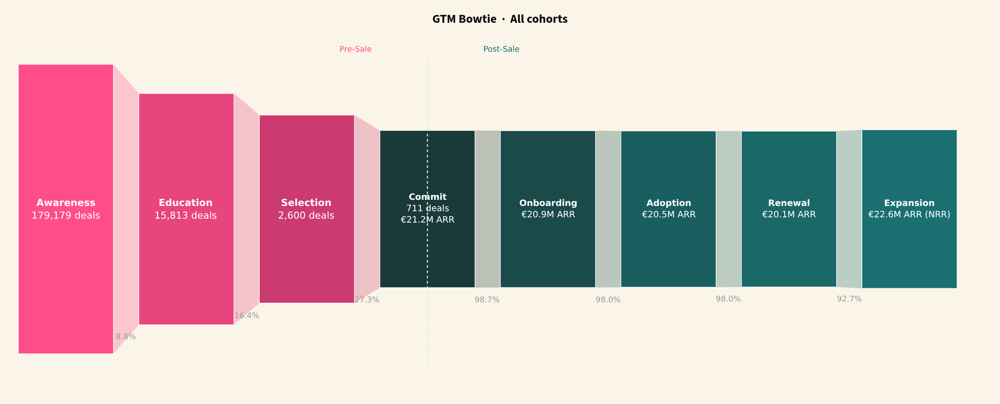
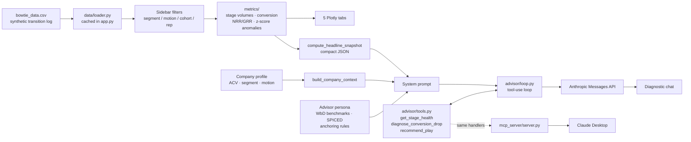
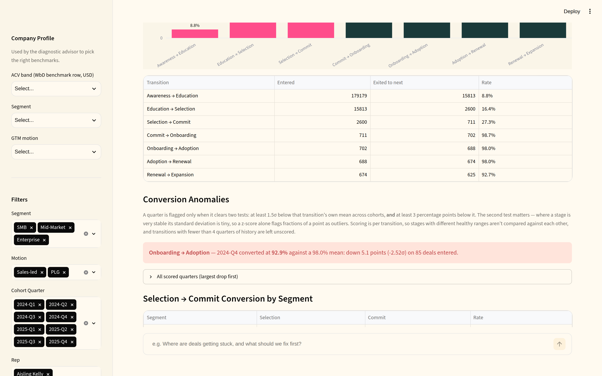

# GTM Health Diagnostic

A diagnostic dashboard for B2B SaaS revenue teams, built on the Winning by Design Bowtie framework, with an AI advisor that reads the filtered data and names where the revenue engine is leaking.

**[Live demo](https://gtm-health-diagnostic-eumwua5bjieoxuxtrwyaar.streamlit.app/)** · Built by [Tom Norton](https://www.linkedin.com/in/tom-p-norton/)



## Why this exists

Eleven years in B2B SaaS customer success and account management teaches you one thing clearly: most GTM problems that land on the customer side started three stages earlier on the sales side. Win rates are soft because qualifying criteria are fuzzy. Onboarding churns high because Impact was never captured at Commit. Expansion stalls because nobody proved ROI before pitching the upsell.

The data to catch these problems earlier usually exists. It is buried in a CRM or a BI tool that takes a week to query, and by the time someone pulls it the quarter is over. I built this to make that diagnosis fast, and to make it argue from the right benchmarks rather than from whichever number was easiest to reach.

## What it does

Eight stages across the Bowtie — Awareness, Education, Selection, Commit, Onboarding, Adoption, Renewal, Expansion — filtered by segment, GTM motion, rep and cohort quarter. Two motions are modelled separately from Selection onward: PLG (self-serve entry, an `activated` flag standing in for whether the account hit its product activation milestone) and Sales-led (MQL/SQL, multi-threaded, longer cycles). Filtering by motion, or asking the advisor a PLG-specific question, draws on real per-motion win rates and activation data rather than a label the dataset can't back up.

| Tab | What it answers |
|---|---|
| **Bowtie Funnel** | Where does volume collapse, and what is the ARR on each side of the Commit knot? |
| **Conversion Rates** | Which stage-to-stage transition is underperforming, and is any quarter a genuine outlier? |
| **Days in Stage** | Where are deals sitting too long, and is the average hiding a bimodal distribution? |
| **NRR / GRR by Cohort** | Is retention structural or is one quarter dragging the average? |
| **Stage Velocity** | Are cycle times degrading over time, or was one quarter noisy? |

Below the tabs, the **RevOps Diagnostic Advisor** (Claude Sonnet 4.6, adaptive thinking) receives a compact headline snapshot plus your ACV band, segment and GTM motion, and calls tools for anything deeper. It applies Bowtie benchmarks, anchors every number to your context before citing it, distinguishes structural trends from one-quarter blips, and declines to invent benchmarks it does not have sourced.

## Project structure

```
metrics/       Pure computation, no Streamlit import: stage volumes, conversion
               rates, NRR/GRR, z-score anomalies, the bowtie chart's data prep.
               Single source of truth — app.py, advisor/tools.py, and
               mcp_server/server.py all call the same functions.
data/          generate.py (the seeded synthetic-data generator), loader.py
               (CSV -> the two dataframes everything else uses), and
               hubspot_source.py (the Live HubSpot connector — same two
               dataframes, built from a real portal's Deals API instead).
advisor/       The diagnostic advisor: persona.py (system-prompt persona),
               tools.py (the three tools + their handlers), context.py
               (system-prompt assembly), loop.py (the tool-use loop).
charts/        Plotly figure builders. Only the bowtie diagram gets its own
               module — the simpler per-tab charts stay inline in app.py.
mcp_server/    Standalone MCP server exposing the same three tools to
               Claude Desktop or any other MCP client. See below.
tests/         pytest over metrics/, advisor/tools.py and
               data/hubspot_source.py, run in CI on every push
               (.github/workflows/tests.yml).
app.py         Streamlit UI only — five tabs, sidebar filters, the Demo/
               Live data-source toggle, the chat surface. Imports
               everything else; defines nothing itself beyond page config,
               CSS, and glue code.
```

## Architecture



The metric layer is the single source of truth: the same functions feed the charts, the advisor's tools, and the standalone MCP server, so none of the three can ever disagree about a number.

## Tool calling and MCP

The advisor used to receive one large JSON dump on every question — every cohort's NRR/GRR, every stage's days-in-stage, the full conversion-rate table — regardless of what was actually asked. That's a **workflow**: fixed steps, no choices. It's now an **agent**: the system prompt carries only a compact headline snapshot (stage volumes, overall GRR/NRR, flagged anomalies, segment and motion performance), and three tools let Claude ask for anything deeper:

- **`get_stage_health(stage, segment?, motion?, cohort?)`** — conversion in/out, days-in-stage, and any anomalies touching one stage.
- **`diagnose_conversion_drop(from_stage, to_stage, segment?, motion?)`** — one transition's full per-cohort history and whether any quarter is flagged.
- **`recommend_play(leak_stage)`** — the canonical Winning by Design intervention for a leak, looked up from a structured table rather than recited from memory.

The difference is concrete, not just architectural: the per-request data payload dropped from roughly 8.9K characters (the old full dump) to about 2.3K (the new headline snapshot) — the removed detail is now fetched only when a question actually needs it. Ask "what about Enterprise specifically?" and the advisor calls `get_stage_health` with `segment="Enterprise"` instead of reasoning from a blended figure it already had sitting in context.

The loop itself (`advisor/loop.py`) is a **hand-rolled request → tool call → tool result → repeat cycle**, not the Anthropic SDK's beta tool runner. That's deliberate: the point of this project is being able to explain exactly how the agentic loop works, and a manual loop is more transparent than a helper that hides the cycle. It also means no beta SDK dependency for three tools this small.

**Consuming an MCP server is table stakes; authoring one is the actual credibility signal.** `mcp_server/server.py` exposes the same three tools — backed by the identical handler functions in `advisor/tools.py` — over the Model Context Protocol, so Claude Desktop (or any other MCP client) can query this dataset directly, with no Streamlit app in the loop at all.

To run it locally and wire it into Claude Desktop:

```bash
pip install -r mcp_server/requirements.txt
```

Add this to Claude Desktop's config file (macOS: `~/Library/Application Support/Claude/claude_desktop_config.json`; Windows: `%APPDATA%\Claude\claude_desktop_config.json`), using the absolute path to the Python interpreter you just installed into and the absolute path to this repo:

```json
{
  "mcpServers": {
    "gtm-bowtie-diagnostic": {
      "command": "/absolute/path/to/gtm-health-diagnostic/.venv/bin/python",
      "args": ["/absolute/path/to/gtm-health-diagnostic/mcp_server/server.py"]
    }
  }
}
```

Restart Claude Desktop, and `get_stage_health`, `diagnose_conversion_drop`, and `recommend_play` appear as tools you can call directly in a conversation — the same diagnostic logic as the dashboard, without the dashboard.

## Methodology

**Conversion is measured as flow, not headcount.** A snapshot count tells you how many deals are currently sitting in a stage, which inflates later stages and understates attrition. Every rate here is `deals that exited into the next stage ÷ deals that entered this stage`, applied identically in the bowtie diagram, the conversion tab and the advisor's context.

**Anomalies require two tests, not one.** A quarter is flagged only when it is both at least 1.5σ below that transition's own mean *and* at least 3 percentage points below it. The second test is the one that matters. Where a stage is very stable its standard deviation is tiny, so a pure z-score flags a 0.2-point move as a −2σ outlier — statistically true, operationally noise. Scoring is per transition, never pooled, because a 25% Selection→Commit rate and a 94% Commit→Onboarding rate are both healthy and comparing them would flag the wrong stage every time.



**Benchmarks are anchored before they are cited.** The same win rate is healthy at one ACV band and alarming at another. The advisor asks for the missing dimension rather than delivering an unanchored comparison.

## Currency

All deal values, ARR and expansion revenue are **EUR**. The Winning by Design Table 6.2 conversion benchmarks are published in **USD**, so the ACV band selector is labelled as the USD benchmark row it selects rather than silently converted. The advisor is told about the mismatch and asked to flag comparisons that sit close to a band boundary. Converting a sourced benchmark to make a chart tidier would have made the citation wrong.

## Data model

`bowtie_data.csv` is generated by `data/generate.py` — a seeded, committed script, not a hand-edited or opaque file. Re-running it reproduces the exact same CSV; changing a parameter and re-running it is how the dataset gets tuned, not by editing rows.

It holds two record types. Awareness and Education are too large to enumerate per lead, so they appear as `aggregate` rows carrying `count_entered` and `count_exited` per segment per cohort, shared across both GTM motions. From Selection onward, `deal` rows are a genuine **transition log**: a deal that reaches Expansion contributes one row for every stage it occupied — Selection, Commit, Onboarding, Adoption, Renewal, Expansion — all sharing one `deal_id`. Exactly one of those rows, wherever the deal's journey ends, has an empty `stage_exited`; `metrics.deal_snapshot()` filters on that to recover one row per deal for ARR and retention math, while the full multi-row log drives stage-level conversion and velocity math, where one row per deal per stage is exactly what's wanted.

This matters concretely: summing `deal_value` across a deal's postsale rows would count its ARR once per stage it reached rather than once. Every NRR/GRR/churn-rate calculation — in the dashboard, the advisor's tools, and the MCP server — goes through `deal_snapshot()` for exactly that reason. It's not a stylistic choice; it's what makes the multi-row model safe to aggregate, and `tests/test_metrics.py` has a regression test asserting the raw log overcounts and the snapshot doesn't.

The generator also injects one deliberate, real anomaly — an Enterprise/Sales-led win-rate collapse in a specific quarter — so the anomaly detector on the Conversion Rates tab has something genuine to find rather than a permanently clean bill of health. Every other quarter is left to ordinary sampling noise, which produces its own smaller, unplanned anomalies alongside the injected one.

## HubSpot connector

A sidebar toggle switches the whole app between the synthetic dataset and a real HubSpot portal's Deals, via `data/hubspot_source.py`. It reads a custom `bowtie_stage` deal property (plus a handful of supporting custom properties) through a HubSpot private app scoped to `crm.objects.deals.read` and `crm.objects.owners.read` — see `data/hubspot_source.py` for the full property list and scopes.

The connector maps deals onto the bowtie via one custom dropdown property, `bowtie_stage` (Selection → Expansion — the six stages a HubSpot deal can meaningfully represent; Awareness/Education stay synthetic-only, since they aren't deals). The interesting part is *how* it reconstructs a transition log rather than a single current-stage snapshot: it calls the Deals API with `propertiesWithHistory=bowtie_stage`, which returns every value that property has ever held, each timestamped. Sorting that list and turning each consecutive pair into a row — stage entered, stage exited into, days between the two timestamps — produces exactly the same multi-row-per-deal shape `data/generate.py` produces. Nothing downstream needed to change: `metrics/`, `advisor/` and `charts/` don't know or care whether a row came from a CSV or a live API call. That was the design goal from the start — a data source swap, not a rewrite.

Live mode degrades to Demo Data automatically, with a specific sidebar message, on every failure mode: no token configured, an invalid or under-scoped token, or a connected portal with no deals yet tagged — never a stack trace. `tests/test_hubspot_source.py` covers the property-history reconstruction (including out-of-order and duplicate history entries) and every one of those failure paths against a mocked API, since there's no way to unit-test against a real portal.

## What I deliberately did not build

Naming what was left out, and why, matters as much as what shipped.

**No automated decisions about individual customers.** The advisor recommends plays for a human to run. It never scores, ranks or flags a named account for action. Under **GDPR Article 22** a person has the right not to be subject to a decision based solely on automated processing where that decision produces legal or similarly significant effects. A model that decides which accounts get renewal attention — and therefore which quietly do not — is close enough to that line that I would want a documented human review step before crossing it. The human-in-the-loop here is not a disclaimer; it is the reason the tool outputs plays instead of account lists.

**No inference on personal data.** `rep_name` is used only to filter aggregates. There is no rep-level performance ranking, no individual productivity scoring, and no profiling of buyers. Rep-level ranking in particular would be an employment-context inference, which carries a materially higher bar than funnel analysis.

**No claim that this is an EU AI Act high-risk system, and no design that would make it one.** Revenue funnel diagnostics is not a listed high-risk use case. It would move toward one if it were extended to score individuals in an employment context, so that specific extension is off the roadmap rather than merely unimplemented. Transparency obligations still apply: the advisor is clearly labelled as AI-generated output and every number it cites is visible in the dashboard above it.

**No data leaves the session.** The demo runs on synthetic data. Nothing is stored, no chat history is persisted server-side, and there is no analytics or tracking layer. The HubSpot connector reads only — it has no write scope and cannot modify a portal — and its access token lives in local secrets, never in the repository. It's meant to run against a developer sandbox with test deals, not a production portal with real customer data.

**No unbounded API spend.** The public demo caps advisor questions per browser session, because it runs on a personal API key. It is a courtesy limit, not a security control.

## Tech stack

- **Streamlit** — app shell, filters, chat surface
- **Pandas / NumPy** — stage-transition maths, cohort aggregation, z-score anomaly scoring
- **Plotly** — bowtie diagram and all charts
- **Anthropic API** (`claude-sonnet-4-6`, adaptive thinking) — the diagnostic advisor, driven through a hand-rolled tool-use loop
- **MCP Python SDK** (`mcp_server/`, kept out of the main app's dependencies) — the standalone MCP server
- **pytest**, run in CI on every push (`.github/workflows/tests.yml`) — the metrics layer and the advisor's tools

## Run locally

```bash
pip install -r requirements.txt
```

Add your Anthropic API key — and, optionally, a HubSpot private-app access token if you want Live mode — to `.streamlit/secrets.toml`:

```toml
ANTHROPIC_API_KEY = "sk-ant-..."
HUBSPOT_ACCESS_TOKEN = "pat-..."
```

Or set either as an environment variable. Then:

```bash
streamlit run app.py
```

The dashboard loads fully without either key; only the advisor requires the Anthropic one, and only Live HubSpot mode requires the HubSpot one — leaving it unset just keeps the Data Source toggle on Demo Data.

To regenerate the dataset (e.g. after changing a parameter in `data/generate.py`):

```bash
python data/generate.py
```

Run from the repo root — it overwrites `bowtie_data.csv` in place and prints a validation summary (row counts, GRR/NRR by segment, and a check that no stage transition lands at exactly 100% or 0%).

To run the test suite:

```bash
pip install pytest
pytest tests/ -v
```

## Roadmap

**Done:**
- A seeded, committed data generator (`data/generate.py`) replaced the opaque CSV — entity-stable `deal_id`s tracing a deal across every stage it occupied, churn weighted to Renewal where the advisor's own benchmarks say it belongs, and separate PLG / Sales-led cohorts so the motion filter and the advisor's PLG-specific reasoning both draw on data that actually exists.
- The advisor moved from a single context-stuffed prompt to a real tool-use loop over `get_stage_health`, `diagnose_conversion_drop` and `recommend_play`, and those same tools now run as a standalone MCP server for Claude Desktop — see [Tool calling and MCP](#tool-calling-and-mcp).
- The codebase split into `metrics/`, `data/`, `advisor/`, `charts/` and `mcp_server/` packages with a pytest suite in CI, so the dashboard, the chat advisor, and the MCP server share one tested source of truth instead of three copies of the same arithmetic.
- A HubSpot connector (`data/hubspot_source.py`) — a Demo/Live toggle pulling real deals from a developer sandbox via the Deals API, mapping HubSpot deals onto bowtie stages through a custom property, with property-history reconstruction so the same conversion, velocity and retention math runs unmodified — see [HubSpot connector](#hubspot-connector).

---

Built by [Tom Norton](https://www.linkedin.com/in/tom-p-norton/) · Figures in EUR · Dataset synthetic
